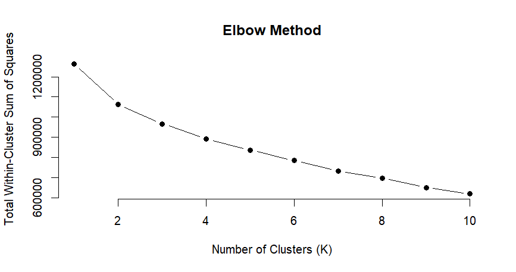
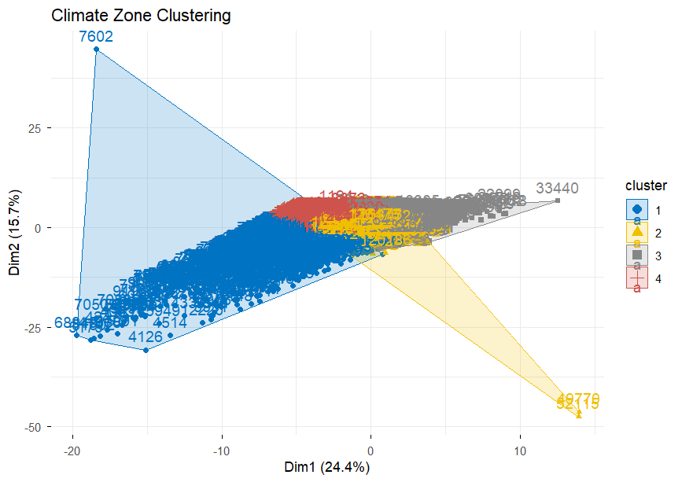
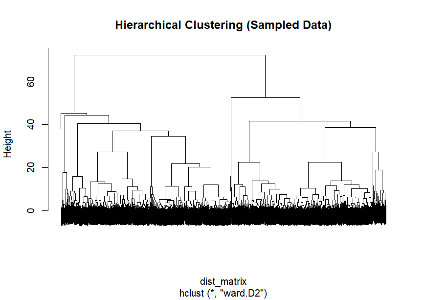
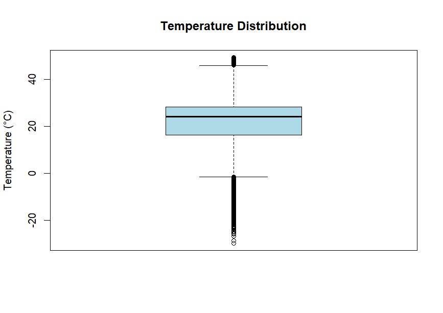
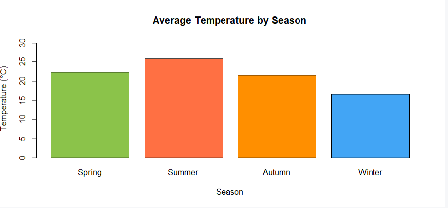
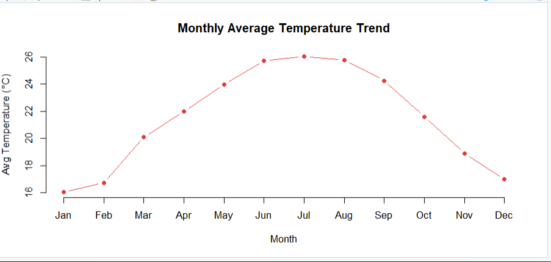
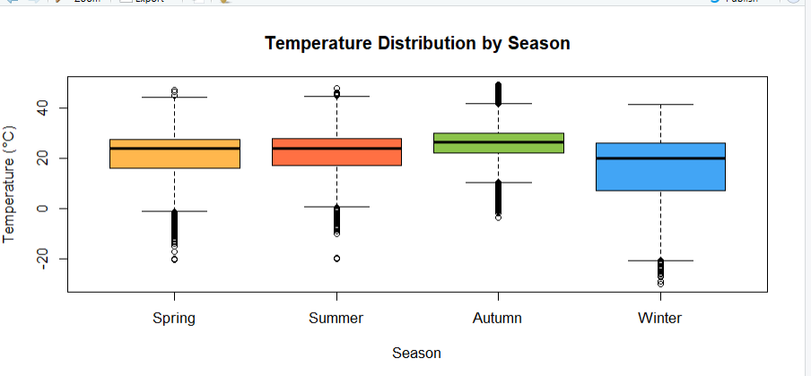
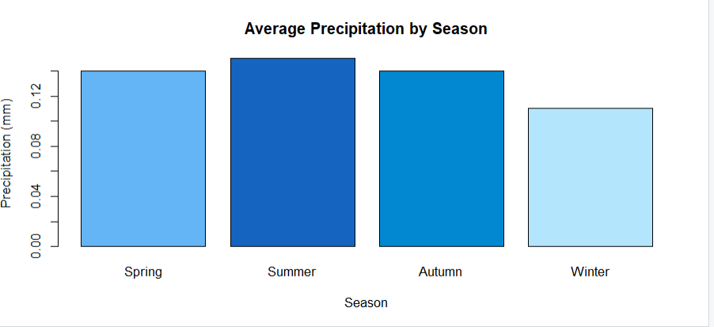
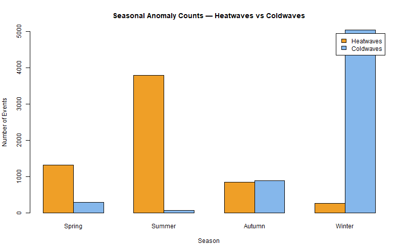

# Climate Zone Clustering & Extreme Weather Anomaly Detection

## Team Members

| Roll Number | Name |
|---|---|
| 2023BCS0030 | A. Yaswant Sai |
| 2023BCS0075 | Ch. Varun Chowdary |
| 2023BCS0174 | P Mashub |
| 2023BCD0045 | K Sai Nihal |

---

## Problem Statement

Global weather data is collected from hundreds of cities worldwide in large volumes but exists without any labels or classifications. No system automatically tells us which city belongs to which climate type, or when an extreme weather event is statistically occurring. This project addresses that gap by applying unsupervised machine learning to automatically classify global weather records into meaningful climate zones and detect extreme weather anomalies — without any pre-existing labels or human annotation.

---

## Objectives

1. Clean and preprocess 126,476 global weather records from the Global Weather Repository
2. Apply K-Means clustering to classify city-level weather readings into distinct climate zones
3. Determine the optimal number of clusters using the Elbow Method (WSS)
4. Validate K-Means results using Hierarchical Clustering with Ward's D2 linkage
5. Detect extreme weather anomalies (heatwaves, coldwaves, heavy rainfall, strong winds, pollution spikes) using Z-score and percentile-based methods
6. Perform seasonal trend analysis by parsing timestamps and aggregating weather metrics by season

---

## Dataset

**Name:** Global Weather Repository  
**Source:** [Kaggle — Global Weather Repository](https://www.kaggle.com/datasets/nelgiriyewithana/global-weather-repository)  
**Number of observations:** 126,476  
**Number of variables:** 42  
**Format:** CSV  
**File name:** `GlobalWeatherRepository.csv`

> The dataset is publicly available on Kaggle. Download it from the link above and place it in the `data/` folder before running the scripts.

### Dataset Structure (Sample Row)

```
country, location_name, latitude, longitude, timezone, last_updated_epoch,
last_updated, temperature_celsius, temperature_fahrenheit, condition_text,
wind_mph, wind_kph, wind_degree, wind_direction, pressure_mb, pressure_in,
precip_mm, precip_in, humidity, cloud, feels_like_celsius, feels_like_fahrenheit,
visibility_km, visibility_miles, uv_index, gust_mph, gust_kph,
air_quality_Carbon_Monoxide, air_quality_Ozone, air_quality_Nitrogen_dioxide,
air_quality_Sulphur_dioxide, air_quality_PM2.5, air_quality_PM10,
air_quality_us-epa-index, air_quality_gb-defra-index,
sunrise, sunset, moonrise, moonset, moon_phase, moon_illumination
```

**Example record:**
```
Afghanistan, Kabul, 34.52, 69.18, Asia/Kabul, 1715849100, 2024-05-16 13:15,
26.6, 79.8, Partly Cloudy, 8.3, 13.3, 338, NNW, 1012.0, 29.89, 0.0, 0.0,
24, 30, 25.3, 77.5, 10.0, 6.0, 7.0, 9.5, 15.3, 277.0, 103.0, 1.1, 0.2,
8.4, 26.6, 1, 1, 04:50 AM, 06:50 PM, 12:12 PM, 01:11 AM, Waxing Gibbous, 55
```

### Key Attributes Description

| Column | Type | Description |
|---|---|---|
| `country` | Text | Country of the city |
| `location_name` | Text | City name |
| `latitude` / `longitude` | Numeric | Geographic coordinates |
| `last_updated` | Datetime | Timestamp of reading (YYYY-MM-DD HH:MM) |
| `temperature_celsius` | Numeric | Air temperature in degrees Celsius |
| `humidity` | Numeric | Relative humidity (%) |
| `wind_kph` | Numeric | Wind speed in kilometres per hour |
| `pressure_mb` | Numeric | Atmospheric pressure in millibars |
| `precip_mm` | Numeric | Precipitation amount in millimetres |
| `cloud` | Numeric | Cloud cover percentage (0–100) |
| `visibility_km` | Numeric | Visibility distance in kilometres |
| `uv_index` | Numeric | UV radiation index (0–11+) |
| `air_quality_PM2.5` | Numeric | Fine particulate matter in µg/m³ — most health-critical measure |
| `air_quality_PM10` | Numeric | Coarse particulate matter in µg/m³ |
| `feels_like_celsius` | Numeric | Perceived temperature accounting for humidity and wind |
| `condition_text` | Text | Human-readable weather condition description |
| `sunrise` / `sunset` | Text | Local sunrise and sunset times |
| `moon_phase` | Text | Current lunar phase name |

> Each row is one weather reading from one city at one timestamp. The same city appears multiple times across different time readings throughout the year.

### Features Selected for Clustering (10 of 42)

| Feature | Reason for selection |
|---|---|
| `temperature_celsius` | Primary climate indicator — defines hot vs cold zones |
| `humidity` | Separates arid from humid climates |
| `wind_kph` | Distinguishes exposed coastal/polar from sheltered inland areas |
| `pressure_mb` | Relates to weather systems — low = storms, high = clear |
| `precip_mm` | Separates desert zones (near 0) from rainy zones |
| `cloud` | Correlated with humidity and rain — high in overcast cluster |
| `visibility_km` | Drops sharply with pollution and fog |
| `uv_index` | High in sunny low-latitude zones |
| `air_quality_PM2.5` | Defining feature of pollution cluster (231 µg/m³) |
| `air_quality_PM10` | Companion pollution measure |

Features dropped: Fahrenheit/mph/inch duplicates, feels_like (derived), condition_text (categorical), moon/sun columns (irrelevant to climate clustering), EPA/DEFRA indices (derived scores).

---

## Methodology

### 1. Data Preprocessing
- Loaded raw CSV with 126,476 records and 42 columns
- Selected 10 numerical meteorological features for clustering
- Dropped redundant duplicate columns (unit conversions, derived indices)
- Replaced all NA values with column mean — result: 0 missing values
- Applied Z-score standardization using `scale()` — normalizes all features to mean=0, SD=1 so no single feature dominates due to scale differences

### 2. Exploratory Analysis
- Inspected data dimensions, column types, and missing value counts
- Plotted temperature distribution boxplot: range -27°C to +47°C, median ~22°C
- Identified right-skewed distributions in precipitation and pollution variables

### 3. K-Means Clustering
- Elbow Method: tested K=1 to K=10, plotted Total Within-Cluster Sum of Squares (WSS)
- Identified K=4 as the optimal number — clear elbow with diminishing returns beyond 4
- Final model: `kmeans(scaled_data, centers=4, nstart=25, set.seed(123))`
- Computed cluster profile means using `aggregate()`
- Assigned climate zone labels based on cluster characteristics:
  - Cluster 1 → **High Pollution Zone** (PM2.5 = 231 µg/m³, 9× other clusters)
  - Cluster 2 → **Cool Temperate** (avg 16.4°C, cleanest air PM2.5 = 25 µg)
  - Cluster 3 → **Humid & Overcast** (humidity 83%, cloud 74%, rain 0.31mm)
  - Cluster 4 → **Hot & Sunny** (avg 28.6°C, UV index 7.5)

### 4. Hierarchical Clustering (Validation)
- Random sample of 2,000 records used (full dataset exceeds RAM for distance matrix)
- Euclidean distance matrix computed with `dist()`
- `hclust(method = "ward.D2")` applied — minimizes within-cluster variance at each merge
- Dendrogram shows 2 major super-clusters at height ~65, each subdividing into 2 = 4 total
- Independently confirms K=4 from the Elbow Method

### 5. Anomaly Detection
- **Z-Score method** for rainfall, wind, pollution: threshold |Z| > 3
- **Percentile method** for temperature: Z-score was unsuitable (threshold would require >58°C which no city reaches, returning 0 heatwaves). Used top 5% (>34°C) as heatwave and bottom 5% (<2.7°C) as coldwave thresholds instead

### 6. Seasonal Trend Analysis
- Parsed `last_updated` timestamp using `as.POSIXct()`
- Extracted month, assigned meteorological seasons (Spring/Summer/Autumn/Winter)
- Aggregated mean temperature, humidity, precipitation, wind, PM2.5 per season
- Counted heatwave and coldwave events per season

---

## Results

### Climate Zone Distribution

| Climate Zone | Records | Avg Temp | Humidity | PM2.5 | Sample Cities |
|---|---|---|---|---|---|
| High Pollution Zone | 1,571 | 26.5°C | 35.5% | 231 µg/m³ | Beijing, Jakarta, Hanoi |
| Cool Temperate | 36,245 | 16.4°C | 69.2% | 25 µg/m³ | Buenos Aires, Canberra, Baku |
| Humid & Overcast | 49,203 | 19.5°C | 83.0% | 16 µg/m³ | Nassau, Bridgetown, Vienna |
| Hot & Sunny | 39,457 | 28.6°C | 43.9% | 27 µg/m³ | Algiers, Luanda, Manama |

### Anomaly Detection Results

| Event Type | Method | Threshold | Events Detected |
|---|---|---|---|
| Heatwaves | Percentile | Temp > 34°C (95th percentile) | 6,221 |
| Coldwaves | Percentile | Temp < 2.7°C (5th percentile) | 6,317 |
| Heavy Rainfall | Z-score | Z > 3 | 1,774 |
| Strong Wind | Z-score | Z > 3 | 198 |
| Dangerous Pollution | Z-score | PM2.5 Z > 3 | 1,953 |

### Seasonal Summary

| Season | Avg Temp | Humidity | Precipitation | PM2.5 | Records |
|---|---|---|---|---|---|
| Spring | 22.3°C | 63.0% | 0.14 mm | 27.8 µg | 21,216 |
| Summer | 25.8°C | 62.1% | 0.15 mm | 21.2 µg | 35,365 |
| Autumn | 21.6°C | 68.4% | 0.14 mm | 22.7 µg | 35,435 |
| Winter | 16.6°C | 70.2% | 0.11 mm | 27.8 µg | 34,460 |

### Seasonal Anomaly Counts

| Season | Heatwaves | Coldwaves |
|---|---|---|
| Spring | 1,319 | 296 |
| Summer | 3,790 | 81 |
| Autumn | 848 | 896 |
| Winter | 264 | 5,044 |

---

## Key Visualizations

### Elbow Method — Selecting K=4


### K-Means Cluster Visualization (PCA-reduced)


### Hierarchical Clustering Dendrogram


### Temperature Distribution (Overall)


### Average Temperature by Season


### Monthly Average Temperature Trend


### Temperature Distribution by Season


### Average Precipitation by Season


### Seasonal Anomaly Counts — Heatwaves vs Coldwaves


---

## How to Run the Project

### Prerequisites
- R version 4.0 or above: https://cran.r-project.org
- RStudio (recommended): https://posit.co/download/rstudio-desktop/

### Step 1 — Clone the repository
```bash
git clone https://github.com/YOUR_USERNAME/ClimateZoneClustering_Team4.git
cd ClimateZoneClustering_Team4
```

### Step 2 — Download the dataset
Download `GlobalWeatherRepository.csv` from Kaggle:
https://www.kaggle.com/datasets/nelgiriyewithana/global-weather-repository

Place the file here:
```
data/GlobalWeatherRepository.csv
```

### Step 3 — Install required packages
```r
source("requirements.R")
```

### Step 4 — Run scripts in order
```r
source("scripts/01_data_preparation.R")
source("scripts/02_exploratory_analysis.R")
source("scripts/03_modeling.R")
source("scripts/04_evaluation.R")
```

Or run the complete pipeline in one go:
```r
source("scripts/climate_project.R")
```

### Folder Organization
```
ClimateZoneClustering_Team4/
│
├── README.md                            # Project documentation (this file)
├── requirements.R                       # Package installation script
│
├── data/
│   └── dataset_description.md           # Dataset info — CSV not uploaded
│
├── scripts/
│   ├── 01_data_preparation.R            # Data loading, cleaning, scaling
│   ├── 02_exploratory_analysis.R        # EDA, structure inspection, boxplot
│   ├── 03_modeling.R                    # K-Means, Elbow, Hierarchical clustering
│   ├── 04_evaluation.R                  # Anomaly detection, seasonal analysis
│   └── climate_project.R               # Full pipeline (all parts combined)
│
├── results/
│   ├── figures/
│   │   ├── Elbow_method_image.png
│   │   ├── K_clustering_visualization.png
│   │   ├── Dendogram.png
│   │   ├── Temp_distribn_Plot.png
│   │   ├── avg_temp_by_season.png
│   │   ├── monthly_avg_temp_trend.png
│   │   ├── temp_distribution_by_season.png
│   │   ├── precipitation_by_season.png
│   │   └── seasonal_anomaly_chart.png
│   │
│   └── tables/
│       ├── cluster_profiles.csv         # Aggregate means per cluster
│       ├── seasonal_summary.csv         # Seasonal averages
│       └── anomaly_counts.csv           # All anomaly event counts
│
└── presentation/
    └── project_presentation.pptx        # Final slides
```

---

## Conclusion

This project successfully applied unsupervised machine learning to 126,476 global weather records, producing four well-defined climate zones and comprehensive extreme event detection:

- The **High Pollution Zone** cluster (PM2.5 = 231 µg/m³) is the most critical finding — the algorithm automatically identified a global air quality crisis grouping cities like Beijing, Jakarta, and Hanoi with no human input
- A methodological flaw in Z-score temperature detection was diagnosed (threshold of ~58°C unreachable) and corrected using percentile-based detection, yielding 6,221 valid heatwave events
- Both K-Means and Hierarchical Clustering independently converged on the same 4-cluster structure, confirming result robustness
- Seasonal analysis revealed Summer as the dominant heatwave season (3,790 events) and Winter as the dominant coldwave season (5,044 events), with Autumn uniquely balanced between both extremes
- Pollution peaks in Spring and Winter — consistent with agricultural burning and home heating emissions respectively

---

## Contribution

| Roll No | Name | Contribution |
|---|---|---|
| 001 | A. Yaswant Sai | Data preprocessing, feature selection, Z-score standardization, exploratory analysis |
| 002 | Ch. Varun Chowdary | K-Means clustering, Elbow method, cluster profiling, climate zone labeling |
| 003 | P Mashub | Hierarchical clustering, dendrogram analysis, anomaly detection, visualizations |
| 004 | K Sai Nihal | Seasonal trend analysis, report writing, presentation preparation |

---

## References

- Kaggle Dataset: https://www.kaggle.com/datasets/nelgiriyewithana/global-weather-repository
- R kmeans() documentation: https://stat.ethz.ch/R-manual/R-devel/library/stats/html/kmeans.html
- R hclust() documentation: https://stat.ethz.ch/R-manual/R-devel/library/stats/html/hclust.html
- factoextra R package: https://rpkgs.datanovia.com/factoextra/
- tidyverse documentation: https://www.tidyverse.org/
- WHO Air Quality Guidelines (PM2.5): https://www.who.int/news-room/fact-sheets/detail/ambient-(outdoor)-air-quality-and-health
- MacQueen, J. (1967). Some methods for classification and analysis of multivariate observations. *Proceedings of the Fifth Berkeley Symposium on Mathematical Statistics and Probability.*
- Ward, J.H. (1963). Hierarchical grouping to optimize an objective function. *Journal of the American Statistical Association*, 58(301), 236–244.
