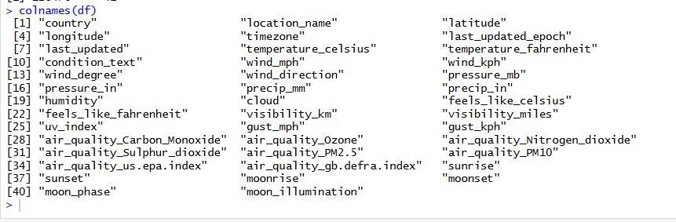

# Dataset Description

**Dataset Name:** Global Weather Repository  
**Source:** https://www.kaggle.com/datasets/nelgiriyewithana/global-weather-repository  
**Format:** CSV  
**File name:** `GlobalWeatherRepository.csv`

## How to Download

1. Go to: https://www.kaggle.com/datasets/nelgiriyewithana/global-weather-repository
2. Sign in to Kaggle (free account required)
3. Click the Download button
4. Extract the ZIP file
5. Place `GlobalWeatherRepository.csv` in this `data/` folder

## Dataset Summary

| Property | Value |
|---|---|
| Number of records | 126,476 |
| Number of columns | 42 |
| File size | ~50 MB |
| Time period | 2024 |
| Geographic coverage | Cities worldwide |

## Column Groups

## Features Used in This Project

Only 10 of 42 columns were selected for clustering:
`temperature_celsius`, `humidity`, `wind_kph`, `pressure_mb`, `precip_mm`,
`cloud`, `visibility_km`, `uv_index`, `air_quality_PM2.5`, `air_quality_PM10`
